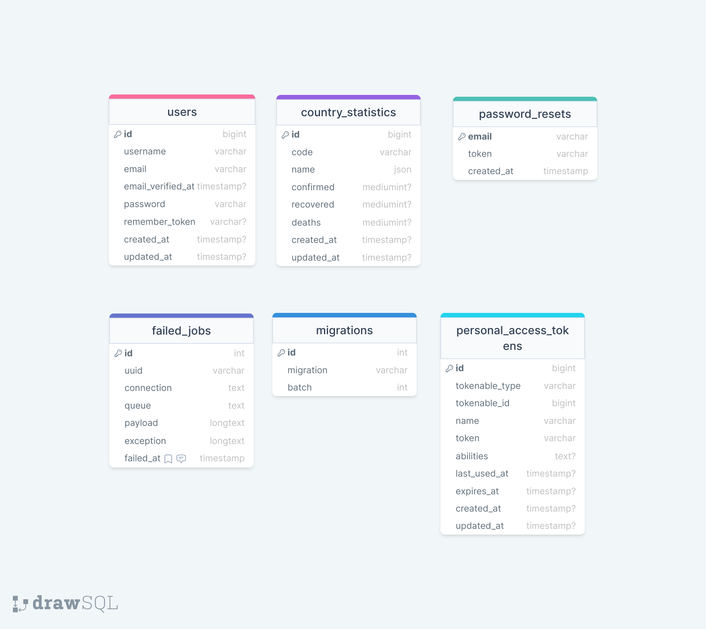

<div style="display:flex; align-items: center">
  <h1 style="position:relative; top: -6px" >Corona time</h1>
</div>

---

This is an informational project about covid-19. So when user regisers, he/she will be able to see data of countries:
new cases, recovers and deaths caused by corona virus.

#

### Table of Contents

-   [Prerequisites](#prerequisites)
-   [Tech Stack](#tech-stack)
-   [Getting Started](#getting-started)
-   [Migrations](#migration)
-   [Development](#development)
-   [Database Design](#database-design-diagram)

#

### Prerequisites

-   *PHP@7.2 and up*
-   _MYSQL@8 and up_
-   _npm@6 and up_
-   _composer@2 and up_

#

### Tech Stack

-   [Laravel@6.x](https://laravel.com/docs/6.x) - back-end framework
-   [TailwindCss](https://tailwindcss.com/) - front-end css framework

#

### Getting Started

1\. First of all you need to clone E Space repository from github:

```sh
git clone https://github.com/e-space1/espace-back.git
```

2\. Next step requires you to run _composer install_ in order to install all the dependencies.

```sh
composer install
```

3\. after you have installed all the PHP dependencies, it's time to install all the JS dependencies:

```sh
npm install
```

and also:

```sh
npm run dev
```

in order to build your JS/SaaS resources.

4\. Now we need to set our env file. Go to the root of your project and execute this command.

```sh
cp .env.example .env
```

And now you should provide **.env** file all the necessary environment variables:

#

**MYSQL:**

> DB_CONNECTION=mysql

> DB_HOST=127.0.0.1

> DB_PORT=3306

> DB_DATABASE=**\***

> DB_USERNAME=**\***

> DB_PASSWORD=**\***

#

**MAILGUN:**

> MAILGUN_DOMAIN=**\*\***

> MAILGUN_SECRET=**\*\***

after setting up **.env** file, execute:

```sh
php artisan config:cache
```

in order to cache environment variables.

4\. Now execute in the root of you project following:

```sh
  php artisan key:generate
```

Which generates auth key.

##### Now, you should be good to go!

#

### Migration

if you've completed getting started section, then migrating database if fairly simple process, just execute:

```sh
php artisan migrate
```

#

### Running Unit tests

Running unit tests also is very simple process, just type in following command:

```sh
composer test
```

#

### Development

You can run Laravel's built-in development server by executing:

```sh
  php artisan serve
```

when working on JS you may run:

```sh
  npm run dev
```

it builds your js files into executable scripts.
If you want to watch files during development, execute instead:

```sh
  npm run watch
```

it will watch JS files and on change it'll rebuild them, so you don't have to manually build them.

#

### Deployment with CI \ CD

Continues Development / Continues Integration & Deployment steps:

-   CI \ CD process first step is of course is development.
-   After some time of development when you are ready to integrate and deploy your feature/fix/work you make a commit or pull request to gihub branch.
-   That triggers github action which listens to pull requests and commits on development and master branch. Github actions will set up configure project, run unit tests.
-   If unit tests fail, you go a head and do some fixing and aftermath try again.
-   If unit tests succeed then github actions will deploy your code to development or production server according to the branch you are making commit to.
-   After deploying, github actions script will build your code and run migrations all to be up to date.

Then everything should be OK :pray:

#

### Database Design diagram


<br />
